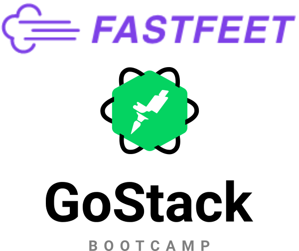

<h1 align="center">
  
</h1>

Este código foi desenvolvido como desafio final do Bootcamp GoStack da [Rocketseat](https://rocketseat.com.br)

 <a href="#rocket-tecnologias">Tecnologias</a>&nbsp;&nbsp;&nbsp;|&nbsp;&nbsp;&nbsp;
 <a href="#computer-instalação-execução-e-desenvolvimento">Instalação, execução e desenvolvimento</a>&nbsp;&nbsp;&nbsp;

## :rocket: Tecnologias

Esse projeto foi desenvolvido com as seguintes tecnologias:

- [Node.js](https://nodejs.org/en/)
- [React](https://reactjs.org/)
- [Docker](https://www.docker.com/)
- [PostgreSQL](https://www.postgresql.org/)
- [Express](https://github.com/expressjs/express)
- [Redis](https://redis.io/)
- [Bee-Queue](https://github.com/bee-queue/bee-queue)

## :computer: Instalação, execução e desenvolvimento

Faça um clone desse repositório.

### Pré-requisitos

- [Node.js](https://nodejs.org/en/)
- [Docker](https://www.docker.com/)

### Backend

- A partir da raiz do projeto, entre na pasta rodando `cd fastfeet-backend`;
- Rode `yarn` ou `npm install` para instalar sua dependências;
- Rode `cp .env.example .env` e preencha o arquivo `.env` com SUAS variáveis ambiente;
- Rode `docker run --name database -e POSTGRES_PASSWORD=docker -p 5432:5432 -d postgres` para subir o banco de dados;
- Rode `docker run --name redisfastfeet -p 6379:6379 -d -t redis:alpine` para subir o redis;
- Rode `yarn sequelize db:migrate` ou `npx sequelize db:migrate` para executar as migrations;
- Rode `yarn sequelize db:seed:all` ou `npx sequelize db:seed:all` para adicionar o usuário admin;
- Rode `yarn build` ou `npm run build` para fazer a build do backend;
- Rode `yarn start` ou `npm start` para iniciar o servidor;
- Importe o arquivo `Insomnia.json` desse repositório no Insomnia;

### Web

_ps: Antes de executar, lembre-se de iniciar o backend deste projeto_

- A partir da raiz do projeto, entre na pasta do frontend web rodando `cd fastfeet-frontend`;
- Rode `yarn` ou `npm install` para instalar as dependências;
- Rode `yarn start` ou `npm start` para iniciar o client web;

### Mobile

Obs.: Esse projeto mobile foi testado apenas no **Android**.

_ps: Antes de executar, lembre-se de iniciar o backend deste projeto_

- A partir da raiz do projeto, entre na pasta do frontend mobile rodando `cd fastfeet-mobile`;
- Rode `yarn` ou `npm install` para instalar as dependências;
- Edite o arquivo `fastfeet-mobile/src/services/api.js`, alterando `baseURL` para o IP correspondente a máquina que estiver executando o `backend`;
- Abra o emulador do Android ou conecte seu dispositivo via USB, em seguida, rode `yarn react-native run-android` ou `npx react-native run-android`;

---

Projeto desenvolvido por [Thales](https://www.linkedin.com/in/linkthales/)
